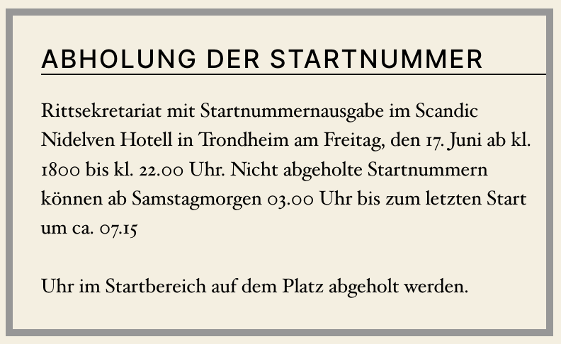
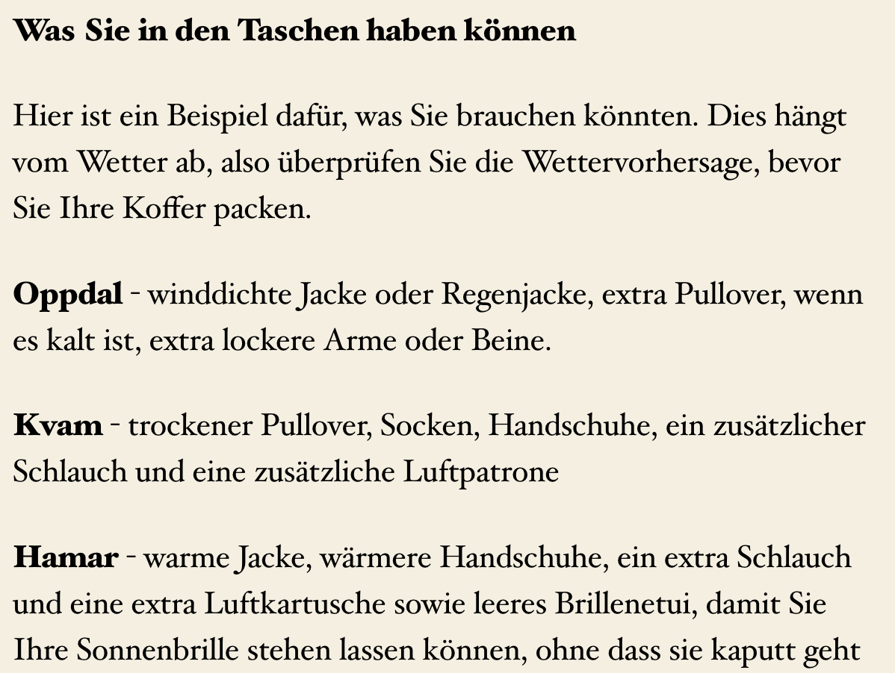
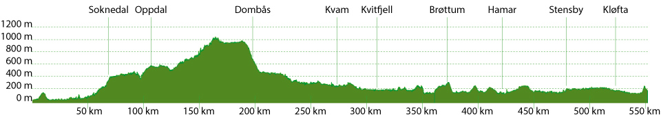

# Styrkeproven

## Vorbereitung
 - [ ] Unterkunft Matti 1 Woche vorher absprechen / ggf gebuchte Untekrunft stornieren (Christopher)
 - [ ] Shuttle Trondheim Airport Unterkunft
 - [ ] Schlüsselabholung klären (Johann)
 - [ ] Nummern Service + Veranstalter einspeichern (vor Ort)

## Vorort
- [ ] Einkaufen
- [ ] Startnummern abholen
- [ ] Start angucken
- [ ] Kleine Runde drehen
- [ ] Reiskuchen vorbereiten
- [ ] [Beutel für die (3!!!) Verpflegungsstationen packen](https://styrkeproven.no/poseplanen-for-trondheim-oslo/)
- [ ] [Gepäcktransport => Oslo (Vor dem Start in Trucks)](https://styrkeproven.no/poseplanen-for-trondheim-oslo/)

  

## Verpflegung
- ~ 1.000 kcal/person/h => 4x20x1.000 = **80.000kcal!!!**
- ~ 500 - 800 mL/person/h
-  [ ] Elos
-  [ ] Ricola/ Salbei Bonbons

| Food                          | Menge     |    kcal   | Who?        |
|-------------------------------|-----------|-----------|-------------|
|Dattel-Haferflocken Bällchen   |      ?    |  ?        | Paul        | 
|Haferkraft                     | 12x4x35gr | 7.152     | Christopher |
|Cliffbar                       |           |           |             |  
|Schockobrötchen(4x360gr        | 4x8x45gr  | 4.768     | vor Ort     | 
|Schokolade                     |     ?     |   ?       |     ?       | 
|Reiskuchen                     |           |           | vor Ort     |
|Summe                          |           |  12.000   |             |

## Werkzeug/ 
-  [ ] Imbus Set
-  [ ] 13/15er Maulschlüssel
-  [ ] Reifenheber (je 2x?)
-  [ ] Pumpe (je 2x?)
-  [ ] jeder 3 Schläuche?
-  [ ] Notfall flicken

## Packliste (Was zu welcher Station?)
- [ ] Einteiler (2x)
- [ ] "Fahrradtasche"
- [ ] Handschuhe
- [ ] Helm
- [ ] Hose (2x)
- [ ] Licht (vorne und hinten)
- [ ] Mütze
- [ ] Oberteile (?x wechsel)
- [ ] Regenjacke
- [ ] Socken (2x) 
- [ ] Überziehschuhe
- [ ] Weste? 

## Planung Stationen
Was möchten wir an welcher Station haben und wer ist für den Beutel "verantwortlich".

|Ort                    | km    | Wer       | Anziehsachen  | Essen |
|-----------------------|-------|-----------|---------------|-------|
|Soknedal               | 62km  |           | nur Wasser auffüllen  |
|Oppdal / Fagerhaug     | 107km |           |               |       |
|Dombas                 | 198km |           |   trockene Anziehsachen vor/ in der Abfahrt            |       |
|Kvam                   | 264km |           |               |       |
|Kvitfjelltunet         | 308km |           |               |       |
|Brottum                | 372km |           |               |       |
|Hamar                  | 422km |           |               |       |
|Stensby-Krankenhaus    | 479km |           |               |       |
|Die Schlucht           | 524km |           |               |       |
  